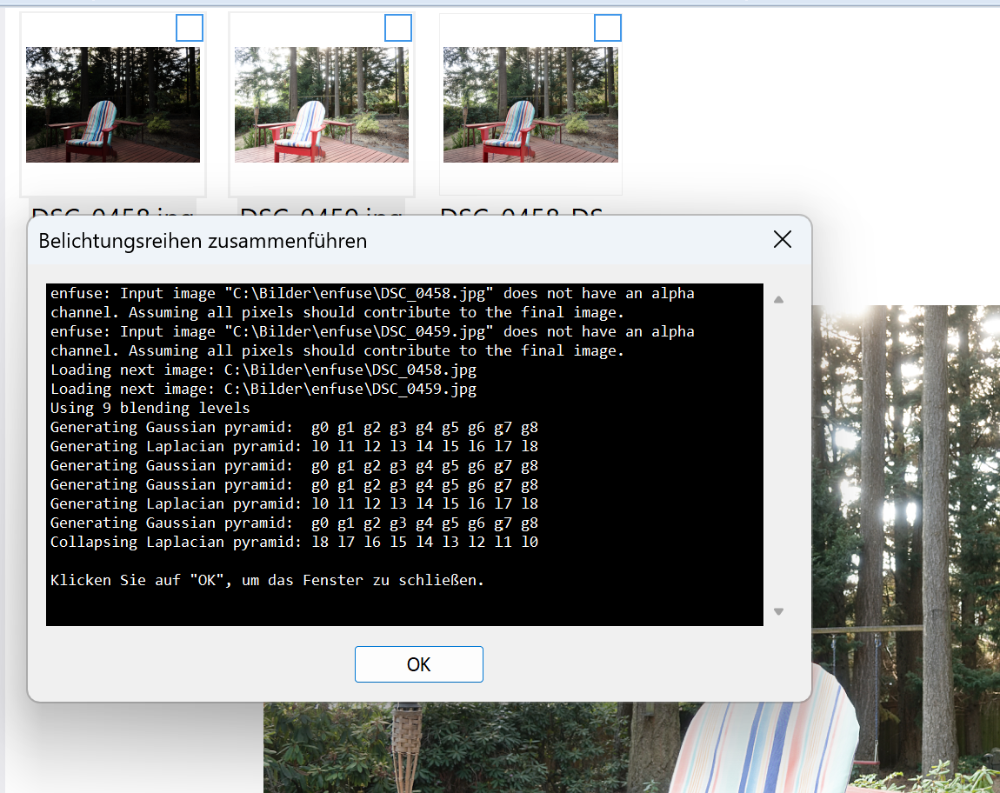

# cPicture-plugins
Plugins for the cPicture App

cPicture supports function plug-ins to process/display selected pictures.  
The Plug-In is a DLL-File located in the same folder as cPicture and starts with 'cpp_'. For example 'cpp_fp1.dll'.  
Click the function plug-ins button in the menu ribbon to display all installed plug-ins.

   

<br>Sample 1
--------

   

   

   

   

   

<br>Sample 2
--------

   

<br>Sample 3
--------

   


<br>.bat Script
-----------

The script files need to be in the same folder. You can use max 255 scripts.  

example.bat file:


    @echo OFF

    echo file  =%1
    echo name  =%2
    echo path  =%3
    echo width =%4
    echo height=%5
    echo sequence number=%6 
    echo number of files=%7


    REM "Press any key to continue ..."
    pause

   


<br>Powershell script
-----------------
  

[example-script.ps1](fp_ps1_script/scripts/example-script.ps1)  

```
$picture_data_set = ConvertFrom-Json -InputObject $picture_data_json

# Print the number of pictures.
[int]$size = $picture_data_set.length
Write-Host "$size picture(s):" -ForegroundColor White
Write-Host ("-" * 15)
Write-Host

# Print the picture data.
[int]$i = 1
foreach ($picture_data in $picture_data_set) {

    [int]$MP = $picture_data.width * $picture_data.height / 1000000
    "Image '{0}' ({4} of {5}) with {1}x{2} pixel ({3}MP)" -f $picture_data.file, $picture_data.width, $picture_data.height, $MP, $i, $size
    "  name='$($picture_data.name)', dir='$($picture_data.dir)'`n"

    "-" * 70

    $i++
}
```

   


<br>HDR enfuse
---------------------

This plugin uses the [enfuse tool](https://wiki.panotools.org/Enfuse) to create a HDR picture from at least 2 pictures.  

   


<br>Structure and details
---------------------

A function plug-ins will be executed in 3 steps.
 The following example displays a message box for each step.

### Step 1

The function start(...) will be called with a list of all selected pictures.
 In this first sample, all picture names will displayed in the message box:

   


### Step 2

The function process_picture(...) will be called for each selected picture:

   


### Step 3
The funktion end() will be called last:

   

The return value determines which pictures were modified/deleted or added.
cPicture adjusts the display accordingly.


cPicture can supply each picture with additional picture data. This is controlled by the return value of start(...).
 With this you can easily create external display applications (example above) or simply call a script or an external program.
 The execution stops if the return value is set to 'false'.

